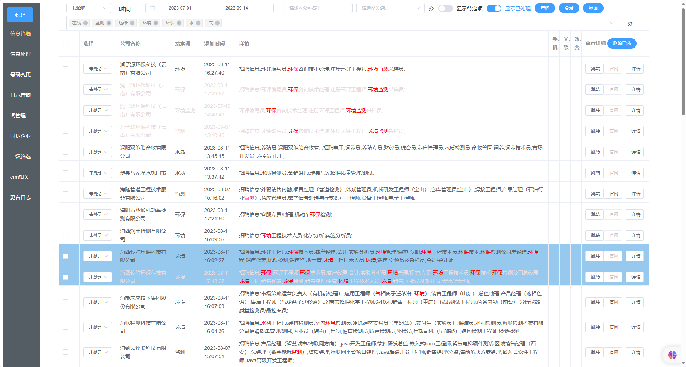
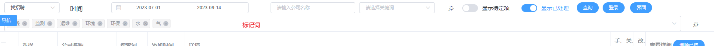
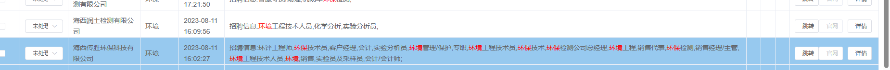
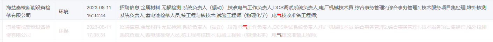
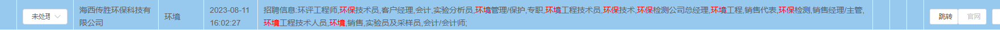
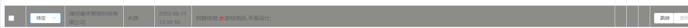
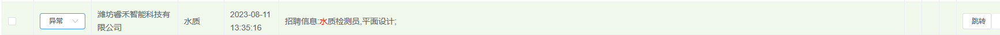
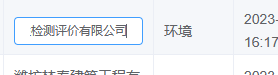

# client

该项目为客户管理系统，通过抓取数据，对客户进行管理和筛选。加速寻找客户的过程，提高工作效率。

# 页面布局


点击收起可收起导航栏

# 功能介绍

## 客户列表

### 基础介绍


上一行为条件查询，下一行为标记词，可在该页面用红色标记所有出现的词


3个标记字段

- 手机：手机号是否抓取
- 关联：该公司是否存在联系方式关联
- 改变：该公司手机号存在是否改变

左边操作介绍

- 跳转：跳转到crm系统中的客户详情页
- 官网：跳转到客户官网
- 详细：跳转到客户信息页

对与不同的情况有着颜色标记。
颜色说明：
crm颜色优先级大于其他背景色

- 重复颜色
  修改其字体颜色为灰色
  
- 在crm系统中
  蓝色背景
  
- 已处理
  
- 异常
  浅黄
  

### 改名

双击表格公司名称可进行修改,然后按下回车或点击其他地方确认后则会进行全数据库全库改名。


## 信息处理页面

信息处理页作为客户筛选的第二道关。

- 基础的条件查询
- 添加crm
- 修改处理状态
- 删除不相关
- 备注等

## 二级筛选

- 二级筛选

通过搜索词和关键词进行客户收集。

需要去系统选定条件复制其请求体

搜索词是进行查询的，关键词是查询到的客户必须要包括的词（通过空格隔开的是且的关系，多个词之间是或的关系）

- 信息筛选

展示抓取来的客户，可以进行关键词标红也可以进行条件查询

- 客户详细

通过信息页进入详情页，可以查看客户的详细信息，并标红关键词。

并且可以展示客户之间的关联图（只能看数据库存在的）。

- 信息处理

对筛选的客户进行是否加入crm处理

- 号码变更

展示crm系统中联系方式变更的客户，方便联系

- 日志查询

操作日志，这个日志作用不大

- 词管理

可以对常用筛选/搜索/标记词进行管理方便下次使用

- 同步企业

同步crm系统中的客户

- crm相关

crm系统相关操作页面

# 版本更新

## 1.0

基础功能完善。

## 1.1

新增异常状态,异常的公司这边灰色背景

## Project setup

```
npm install
```

### Compiles and hot-reloads for development

```
npm run serve
```

### Compiles and minifies for production

```
npm run build
```

### Lints and fixes files

```
npm run lint
```

### Customize configuration

See [Configuration Reference](https://cli.vuejs.org/config/).
